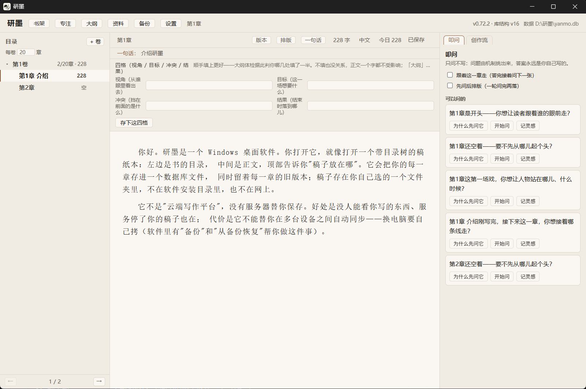

# Yanmo (研墨)

**An offline, local-first Chinese novel-writing app for Windows**, built with Rust + Tauri.

Your manuscript is just a plain folder on your own computer. No cloud, no account, no telemetry,
no feature locked behind a paywall. Open source under **AGPL-3.0-or-later**.

[中文说明](./README.md) · [Download](#download) · [Security notes](./SECURITY.md)

> **Status: in development.** The everyday tools for writing a long novel already work, but please
> keep a second copy of any manuscript you care about. Details under [What works today](#what-works-today).



*Chapter tree (left) · manuscript (middle) · **questions** (right). The questions panel asks you
about plot, outline and uncollected foreshadowing — that line is **not shipped yet**, the screenshot
is from a development build. The current release is 0.68.1.*

## What it is

A desktop app for writing Chinese long-form fiction — chapter-based novels, web novels, serials.
You open it and it looks like a manuscript notebook with a table of contents: the book tree on the
left, the text in the middle, and a line at the top telling you **where your files live**.

Each chapter is stored in a database file that sits in a folder *you* choose — not in the install
directory, not on a server. Every chapter keeps its own version history, and deleted chapters go to
a recycle bin instead of vanishing.

It is **not** a cloud writing platform: there is no server holding your work. The upside is that
nobody can read what you write and your manuscript survives even if the project stops being
maintained. The trade-off is that it will **not** sync between machines for you — moving to a new
computer means copying the folder (the built-in backup and restore tools are there to help).

## Why people pick it

| What you are worried about | What Yanmo does |
| --- | --- |
| Losing a chapter to a slip of the keyboard | Per-chapter **version history**, plus a recycle bin that can restore a chapter or a whole book |
| Losing the manuscript entirely | Autosave ~0.25 s after you stop typing; if saving is impossible it **blocks you** and lets you export what you have; **multiple backup destinations**, run once a day |
| Being locked in by a vendor | Source is open, format is open, one-click export out. Your work stays readable even if this app never updates again |
| Hidden cloud uploads and telemetry | The app has no network capability at all — and there is a machine check in CI that fails the build if any appears. Verify it yourself with a firewall |
| Chinese word counting done wrong | Three word-count modes (every character / characters excluding punctuation / by word) using Chinese rules, not English tokenisation |
| Handing a manuscript to an editor | One-click export: submission-ready `.docx`, per-chapter `.txt`, merged `.txt` |
| Getting distracted | Focus mode (`F9`) leaves only the text and a thin status bar |
| Software stops working some day | A bundled command-line tool (double-click for a Chinese menu) can read out and export your manuscript when the GUI will not start |

## What it deliberately does not do

- **It does not generate prose for you.** Chinese web-novel platforms ban AI-generated text, so
  Yanmo stays inside their rules: proofreading, creative-element assistance and rough outlining only.
- **It does not upload your manuscript.** The app itself does not go online, and that is machine-checked.
- **It does not paywall the core.** Everything essential is open source and free forever. Any future
  add-on module would be a separate program, never a switch inside the core.
- **It does not silently edit your text.** Every "automatic" action (backups, typesetting advice)
  only reports; it changes something when you say so.

## What works today

- Editor: body text, chapter titles, a one-line chapter summary, autosave, three word-count modes
- Chapter tree: volumes and chapters, drag to reorder, rename, insert, per-chapter word counts
- Numbering that follows position automatically (insert / delete / drag / restore), continuous
  across volumes by default, or restarting at 1 in each volume — your choice in settings
- Multiple books on a shelf, per-book cursor memory, book language (Chinese / English / Japanese)
- Recovery: recycle bin, per-chapter version history with diff and rollback
- Safety: multiple backup destinations, restore from backup, save-on-close, crash notice, single instance
- Export: submission `.docx`, per-chapter `.txt`, merged `.txt`; typesetting clean-up (reports first)
- Statistics: daily progress, daily goal, writing calendar, streaks
- Comfort: focus mode (`F9`), outline hover cards, shortcuts (`Ctrl+S`, `Ctrl+Alt+←/→` to switch chapter)
- Typesetting panel: font size / line height / letter spacing for reading only, never touching the text

**Planned, not shipped yet:** the "questions" panel (it asks *you* questions about what happens next;
rules produce the question, AI only polishes the wording), a writing-trail record that can show a
manuscript is your own, full-text search UI, dark mode, and an `.md` mirror of every chapter on disk.

## Download

- **Latest release (0.68.1)**: <https://github.com/KSiukee/yanmo/releases>
- Every asset ships with a matching `.sha256` file:

  ```bat
  certutil -hashfile <downloaded-file> SHA256
  ```

- **Build it yourself**: with Rust, Node and Visual Studio Build Tools installed, run
  `tools\build-release.bat` in the repository root. It checks the toolchain, builds the frontend,
  **runs the test suite (and stops if it fails)**, packages, and writes the artifacts, checksums and
  a build fingerprint into `dist\`. See [CONTRIBUTING.md](./CONTRIBUTING.md) for prerequisites.

Three forms are published from one source and one build:

| File | What it is |
| --- | --- |
| `yanmo-<version>-setup.exe` | Installer (start-menu entry, per-user, no admin rights, no auto-start). **Most people want this.** |
| `yanmo-<version>-portable.exe` | Portable: double-click to run, nothing written to the registry |
| `yanmo-<version>-portable.zip` | Portable folder: keep your manuscript inside the unzipped folder so the whole thing travels on a USB stick |

### The installer is not code-signed

Windows SmartScreen will warn you on first run (*Windows protected your PC* → **More info** →
**Run anyway**). Code-signing certificates cost money and the signing workflows are still being
evaluated; the plan is to decide once there is real download volume. Until then, "open source +
you can build it yourself + published checksums" is a stronger guarantee than a signature. If you
would rather not see the prompt at all, build your own build from source.

## Reliability

Every release has to pass **500+ automated checks** (300+ for the core, 200+ for the interface,
growing every version) covering write / save / close / reopen / restore / export paths. The release
script stops on failure — it never ships with warnings. Some checks exist specifically for the worst
cases: power loss in the middle of an upgrade, the database disagreeing with what is on screen, and
"did a read-only pass change anything". A separate check scans all code for any networking
capability and fails the build if one appears.

## License

**AGPL-3.0-or-later.** In short:

| What you want to do | Allowed | Obligation |
| --- | --- | --- |
| Use it, modify it, privately | ✅ | none |
| Make themes / skins / fonts / dictionaries and share them | ✅ | none |
| Write your own front-end shell (Android / macOS / Linux) against the local protocol | ✅ | **none** — may be closed source, may be paid |
| Fork the core, distribute your version | ✅ | **your version must be AGPL open source** |
| Fork the core, rename it, sell it closed | ❌ | infringement |

Security promises and limitations are in [SECURITY.md](./SECURITY.md); architecture and how to work
on the code are in [CONTRIBUTING.md](./CONTRIBUTING.md).

## Links

- Issues, bug reports, feature requests: <https://github.com/KSiukee/yanmo/issues>
- Donations (Chinese platform, no rewards promised): <https://afdian.com/a/siukee>
